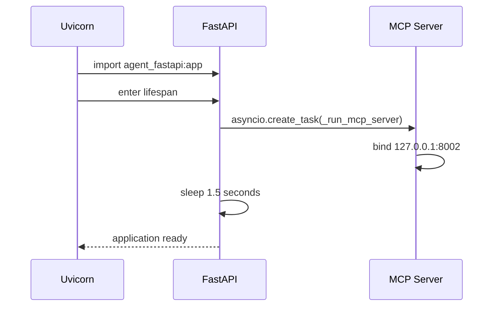
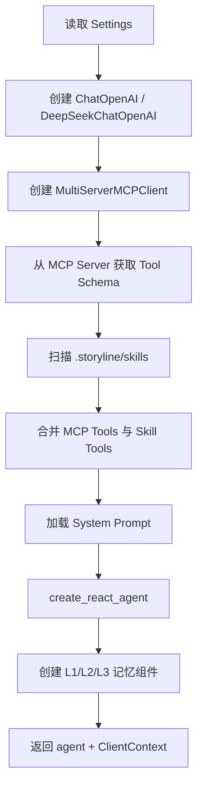

# TravelAgent-AI 技术学习指南

> 面向读者：熟悉 Java 后端、正在学习 Python 和 Agent 开发。  
> 对应代码快照：`5882bc0`。  
> 本文以当前源码行为为准；README 中描述但尚未完整接入的能力，会明确标注。

## 1. 先建立整体认知

这个项目不是传统的“Controller → Service → DAO → Database”应用，而是一个由大模型动态决定执行路径的 Agent 应用。

传统 Java Web 请求通常是：

```text
HTTP Request
  → Controller
  → Service
  → Repository
  → Database / Third-party API
  → HTTP Response
```

本项目的一次对话请求是：

```text
WebSocket Message
  → FastAPI WebSocket Handler
  → 组装 System Prompt + 历史消息 + 记忆
  → LangGraph ReAct Agent
  → LLM 判断下一步
  → MCP Client 调用 Tool
  → MCP Server 执行 Core Node
  → 高德 API / 本地算法 / 另一次 LLM 调用
  → 工具结果写入 ArtifactStore
  → 工具结果返回给 LLM
  → LLM 决定继续调用工具或生成最终回答
  → FastAPI 提取文本、地图数据和 A2UI 卡片
  → WebSocket Response
```

核心区别是：传统业务流程主要由代码中的 `if/else`、方法调用和工作流引擎决定；Agent 的部分控制流由 LLM 根据 Prompt、Tool Schema 和上下文动态决定。

## 2. 技术栈与 Java 体系映射

| 本项目技术 | 作用 | Java 后端类比 |
|---|---|---|
| FastAPI | HTTP/WebSocket 服务框架 | Spring Boot / Spring MVC |
| Uvicorn | ASGI Server | Tomcat、Undertow、Netty Server |
| Pydantic | 配置、参数校验、模型解析 | Bean Validation + Jackson + `@ConfigurationProperties` |
| `asyncio` | 单线程事件循环、异步 I/O | Reactor、WebFlux、CompletableFuture 的部分能力 |
| `httpx.AsyncClient` | 异步 HTTP Client | WebClient |
| LangChain Tool | 给 LLM 使用的结构化函数 | 可被动态路由的 Service 方法 |
| LangGraph ReAct Agent | LLM 驱动的工具调用循环 | 动态工作流引擎，但节点选择由模型完成 |
| MCP | Tool 的标准化远程调用协议 | RPC/Feign/gRPC 的 Agent 工具协议版本 |
| Prompt | 模型运行时指令 | 规则配置 + 工作流说明 + 输出契约 |
| ArtifactStore | 工具结果持久化和上下文快照 | Session Cache / Execution Context |
| Skill | Markdown 描述的复合工作流能力 | 可热加载的流程模板或策略插件 |
| A2UI | Agent 与前端间的结构化 UI 消息 | 自定义 WebSocket 事件协议 |

不要把 LangChain/LangGraph 简单理解成“另一个 Spring”。它更像模型适配、消息模型、Tool Schema 和 Agent 循环的组合层。

## 3. 代码目录应该如何理解

```text
TravelAgent/
├── agent_fastapi.py
│   └── Web 服务入口、WebSocket 会话、前端数据提取
├── cli.py
│   └── CLI 对话入口
├── config.toml.example
│   └── LLM、高德、MCP、记忆和编排配置
├── prompts/
│   └── 系统提示词和任务提示词
├── .storyline/skills/
│   └── Markdown Skill
├── src/travel_agent/
│   ├── agent.py
│   │   └── LLM、Agent、Tool、记忆组件的装配
│   ├── config.py
│   │   └── Pydantic 配置模型
│   ├── orchestration/
│   │   └── 实验性的五层 Agent 编排
│   ├── mcp/
│   │   └── MCP Server 和 Tool 适配层
│   ├── nodes/
│   │   └── 原子工具和确定性业务算法
│   ├── storage/
│   │   └── L1/L2/L3 记忆
│   ├── skills/
│   │   └── Skill 加载适配
│   └── utils/
│       └── Prompt、日志等公共能力
├── web/
│   └── 原生 HTML/CSS/JavaScript 前端
└── tests/
    └── 编排、记忆、A2UI、工具过滤测试
```

如果按照 Java 分层命名理解：

- `agent_fastapi.py` 同时承担 Controller、WebSocket Gateway 和部分 View Adapter。
- `agent.py` 类似 Application Configuration + Agent Factory。
- `mcp/register_tools.py` 类似 RPC Adapter。
- `nodes/core_nodes/` 类似 Domain Service / Integration Service。
- `storage/` 类似 Session Repository，但当前使用本地 JSON。

## 4. Python 阅读基础：Java 开发者最需要适应的部分

### 4.1 类型标注不是 Java 式强制类型

```python
async def search_poi_tool(
    keyword: str,
    city: Optional[str] = None,
    page_size: int = 10,
) -> List[Dict[str, Any]]:
    ...
```

这些标注主要服务于：

- IDE 和静态检查器；
- Pydantic/LangChain 生成参数 Schema；
- 阅读和维护；
- MCP 暴露 Tool 参数。

Python 运行时通常不会自动拒绝错误类型。真正的运行时校验取决于 Pydantic、装饰器或显式代码。

Java 对比：

```java
CompletableFuture<List<Map<String, Object>>> searchPoi(
    String keyword,
    @Nullable String city,
    int pageSize
)
```

### 4.2 `async def` 与 `await`

```python
async with httpx.AsyncClient(timeout=10.0) as client:
    resp = await client.get(url, params=params)
```

这里不是创建一个新线程。典型执行模型是：

1. 协程发起网络请求；
2. 等待 I/O 时把执行权交还事件循环；
3. 事件循环继续处理其他连接；
4. I/O 完成后恢复当前协程。

与 Java WebFlux 相似，但 Python 没有 Reactor 的 `Mono`/`Flux` 包装层，异步控制流直接通过 `async/await` 表达。

注意：

- 异步函数必须由事件循环执行；
- 在异步函数中调用耗时同步代码会阻塞整个事件循环；
- 本项目部分工具是 `async def`，部分确定性算法是普通 `def`，这是合理的；
- CPU 密集算法规模扩大后，应使用线程池、进程池或独立服务。

### 4.3 上下文管理器

```python
@asynccontextmanager
async def lifespan(app: FastAPI):
    ...
    yield
    ...
```

`yield` 之前相当于 Spring Bean/应用启动阶段，`yield` 之后相当于 shutdown hook。

本项目用它启动和停止内部 MCP Server。

### 4.4 `dataclass`

```python
@dataclass
class ClientContext:
    cfg: Settings
    session_id: str
    node_manager: NodeManager
    artifact_store: Optional[ArtifactStore] = None
```

`dataclass` 自动生成构造函数、比较和字符串表示等样板代码。可类比 Java 的 record 或 Lombok `@Data`，但它仍然是普通可变类。

### 4.5 列表推导式和赋值表达式

```python
valid_spots = _dedup([v for p in spots if (v := _valid(p))])
```

等价逻辑：

```java
List<Poi> validSpots = new ArrayList<>();
for (Map<String, Object> p : spots) {
    Poi v = valid(p);
    if (v != null) {
        validSpots.add(v);
    }
}
validSpots = dedup(validSpots);
```

`:=` 是赋值表达式。可以减少重复调用，但不宜滥用。

### 4.6 Duck Typing

代码里经常出现：

```python
content = getattr(message, "content", "") or ""
```

它不要求对象实现某个 Java Interface，只要运行时存在相应属性即可。这使适配代码灵活，也使错误更容易延迟到运行时。

## 5. 应用启动过程

入口是：

```bash
uvicorn agent_fastapi:app --host 0.0.0.0 --port 8000
```

Uvicorn 导入 `agent_fastapi.py` 中的 `app`：

```python
app = FastAPI(title="Travel Smart Assistant", lifespan=lifespan)
```

启动时序：



这里的 MCP Server 是同一 Python 进程中的后台 Task，但它又启动了一个独立 Uvicorn Server，并监听 `8002`。

这带来两个部署约束：

1. 当前不能简单启动多个 Uvicorn worker；每个 worker 都会尝试绑定 `8002`。
2. `sleep(1.5)` 只是经验等待，不是真正的 readiness 检测。

从工程角度，更清晰的生产结构是：

- FastAPI 和 MCP 拆成两个容器；或者
- 不走本地 HTTP MCP，将 Tool 直接注入 Agent；或者
- 只保留一个应用 worker，并接受单实例限制。

## 6. WebSocket 请求生命周期

WebSocket 入口：

```python
@app.websocket("/ws/chat")
async def websocket_endpoint(ws: WebSocket):
```

当前每次建立 WebSocket 连接时：

1. 服务端立即 `accept()`；
2. 生成新的后端 `session_id`；
3. 调用 `build_agent()`；
4. 为该连接维护独立的 `messages` 列表；
5. 循环接收用户消息；
6. 每轮调用 Agent；
7. 返回文本、地图 JSON 和 A2UI 事件。

关键状态：

```text
WebSocket Connection
├── session_id
├── agent
├── ClientContext
└── messages[]
```

这个状态只存在当前连接对应的协程栈中，不在 Redis 或数据库中。

### 6.1 浏览器会话和后端会话不是同一个概念

前端把会话列表保存在 `localStorage`，使用类似：

```text
s_时间戳_随机值
```

后端每次 WebSocket 连接生成：

```text
travel_时间戳_随机值
```

前端没有把自己的 session ID 发给后端，也没有在重连后把完整历史重新发送给 Agent。

因此当前真实语义是：

- 浏览器能显示旧聊天记录；
- WebSocket 重连后，后端认为这是一个新会话；
- 前端显示的旧历史不等于模型仍然拥有这些上下文；
- 页面会话切换主要是 UI/localStorage 行为，不是服务端会话恢复。

这是学习“界面状态”和“模型上下文状态不能混为一谈”的好案例。

### 6.2 超时和重试

Agent 调用被包装为：

```python
await asyncio.wait_for(..., timeout=120)
```

并最多重试一次。

风险点：

- 超时会取消等待中的协程，但第三方 HTTP/模型服务是否立即停止计费，取决于下游实现；
- 重试完整 Agent 请求可能重复调用工具和重复消耗 Token；
- 当前没有幂等键、请求预算或全链路 trace ID。

## 7. Agent 是如何构建的

核心入口是 `src/travel_agent/agent.py` 中的 `build_agent()`。

构建步骤：



### 7.1 DeepSeek 适配

`DeepSeekChatOpenAI` 继承 `ChatOpenAI` 并覆写请求 Payload 生成逻辑：

- 把 list/dict 类型 `content` 拍平成字符串；
- 尝试回注 `reasoning_content`。

这是典型的 Adapter 模式。

Java 中可能写成：

```java
class DeepSeekChatClient extends OpenAiChatClient {
    @Override
    protected RequestPayload buildPayload(...) {
        ...
    }
}
```

需要注意：覆写第三方库内部/半内部方法容易受版本升级影响。项目依赖没有锁定精确版本，因此升级 `langchain-openai` 时应重点回归这里。

### 7.2 ReAct 循环

ReAct 可以抽象为：

```python
while not finished:
    model_output = llm(messages, available_tools)

    if model_output.has_tool_call:
        tool_result = execute(model_output.tool_call)
        messages.append(tool_result)
    else:
        return model_output.text
```

模型并不是执行 Python 函数。模型只输出结构化 Tool Call，例如：

```json
{
  "name": "search_poi",
  "args": {
    "city": "成都",
    "keyword": "历史文化景点"
  }
}
```

LangGraph/LangChain 根据 Tool Schema 找到对应工具并执行。

因此 Tool 的以下内容会直接影响模型决策：

- Tool 名称；
- Tool description；
- 参数名称；
- 参数说明；
- 返回数据结构；
- 错误信息。

Tool Schema 是 Agent 系统中的 API Contract，不只是注释。

## 8. MCP 在项目中的作用

MCP 形成了一个适配边界：

```text
LangGraph Agent
  → MultiServerMCPClient
  → HTTP streamable MCP
  → FastMCP Server
  → mcp_search_poi()
  → search_poi_tool()
  → 高德 API
```

MCP Wrapper 主要负责：

1. 定义暴露给 Agent 的参数 Schema；
2. 从 Header 提取 `X-Travel-Session-Id`；
3. 获取当前 session 的 `ArtifactStore`；
4. 调用底层 Tool；
5. 保存结果；
6. 返回统一信封。

统一返回结构：

```json
{
  "artifact_id": "search_poi_ab12cd34",
  "result": [],
  "isError": false
}
```

### 8.1 为什么不直接使用 Core Tool

MCP 带来的价值：

- Agent 与工具实现解耦；
- 外部 MCP Client 理论上也能使用工具；
- 工具结果持久化被集中放在适配层；
- Tool Schema 可通过协议发现。

成本：

- 同进程内仍然经过 HTTP，增加复杂度和故障点；
- 存在两套 Tool Schema：MCP Wrapper 与 Core Tool；
- 两层参数必须保持一致；
- 调试链路更长。

### 8.2 当前存在的参数契约不一致

当前 `search_poi` MCP Wrapper 调用底层工具时传入：

```python
{
    "city": city,
    "keyword": keyword,
    "types": types,
    "max_results": max_results,
}
```

但底层 `search_poi_tool` 参数是：

```python
keyword, city, category, page_size
```

`types/max_results` 与 `category/page_size` 不一致，可能触发 Tool 参数校验错误。

天气工具也存在类似问题：

- MCP Wrapper 暴露并传递 `forecast`；
- 底层 `check_weather_tool` 当前只接收 `city`。

这是非常典型的“Adapter DTO 与 Domain API 漂移”问题。Java 项目中如果 Feign DTO 与 Service 方法契约各自维护，也会出现相同问题。

建议练习：

1. 为所有 MCP Wrapper 和底层 Tool 建立契约测试；
2. 让参数模型只定义一次；
3. Wrapper 只做显式字段映射；
4. CI 中校验 MCP Schema 与 Core Tool Schema。

## 9. Tool 与普通业务代码

### 9.1 外部 API Tool

`search_poi_tool` 是标准的 Integration Tool：

```text
Tool 参数
→ 读取配置
→ 调用高德 API
→ 校验 HTTP 状态
→ 校验高德业务状态
→ 将第三方数据转换为内部字段
→ 返回 List[Dict]
```

它相当于 Java 中：

```text
PoiApplicationService
→ AmapClient
→ AmapPoiResponse
→ PoiDTO
```

目前项目大量使用 `Dict[str, Any]`。这在原型阶段灵活，但会削弱字段约束。

更适合生产的写法是定义 Pydantic Model：

```python
class Poi(BaseModel):
    name: str
    longitude: float
    latitude: float
    address: str = ""
    rating: str = ""
```

这相当于 Java DTO/record。

### 9.2 确定性算法 Tool

`smart_plan_itinerary_tool` 不调用 LLM，主要执行：

- 经纬度合法性过滤；
- 名称去重；
- K-means 风格地理分组；
- 每日景点数量限制；
- 最近邻排序；
- 雨天室内景点重排；
- 酒店和餐厅分配。

这说明 Agent 项目的正确架构不是“所有事情都交给 LLM”。

合理边界是：

- 模糊意图理解、步骤决策、文本生成：LLM；
- 地理距离、预算计算、排序、校验：确定性代码；
- 实时事实：外部 API；
- 长期状态：数据库/存储。

### 9.3 当前算法实现的学习点

`smart_plan_itinerary.py` 中的 `max_day_radius_km` 被传入 `_cluster_by_day()`，文档也声称会执行半径拆分，但函数体目前没有使用这个参数。

这是“注释/设计与实现漂移”的实例。学习时应养成验证行为而不是只读 Docstring 的习惯。

## 10. Prompt 工程

Prompt 目录约定：

```text
prompts/tasks/<task>/<lang>/system.md
prompts/tasks/<task>/<lang>/user.md
```

`PromptBuilder` 负责：

- 按 task、lang、role 查找文件；
- 内存缓存模板；
- 替换 `{{variable}}`；
- 组合 system/user prompt。

### 10.1 System Prompt 的职责

主 System Prompt 同时承担：

- 角色定义；
- 业务规则；
- 信息完整性判断；
- 工具调用顺序；
- 地图渲染规则；
- 最终输出格式。

这是一种“集中式大 Prompt”设计。

优点：

- 快速调整；
- 不必改 Python 代码；
- 对原型直观。

问题：

- 规则互相冲突时难以定位；
- Prompt 越长，模型越可能忽略局部规则；
- 与 Skill、Tool description、分层编排存在重复控制；
- 缺少版本、评测集和变更回归机制。

### 10.2 Prompt 不是可靠事务逻辑

Prompt 中写“必须先搜索再规划”不等于代码层保证执行。

可以把约束分为三级：

1. 软约束：只写 Prompt；
2. 中约束：限制当前可见 Tool；
3. 硬约束：代码状态机和 Validator 强制校验。

例如：

- “回复使用中文”适合软约束；
- “规划阶段不能调用渲染工具”适合 Tool 白名单；
- “支付金额必须大于零”必须代码校验。

### 10.3 Prompt 测试方法

不要只测试某次回答是否“看起来不错”，应该建立固定案例：

```text
输入：
成都 3 天游，2 人，预算 5000，偏好历史文化

验证：
- 是否调用 search_poi
- 是否调用 check_weather
- 是否调用 hotel/restaurant
- 是否调用 smart_plan_itinerary
- POI 是否都来自 Tool 结果
- 每天是否不超过约定数量
- 是否输出预算和交通建议
```

这类测试比纯文本完全匹配更适合 Agent。

## 11. Skill 机制

Skill 存放于 `.storyline/skills/*/SKILL.md`。

加载过程：

```python
manager = SkillManager(skill_dir=skill_dir)
await manager.adiscover()
tools = create_langchain_tools(manager)
```

也就是说，Skill 最终也被转换为 Agent 可见的 LangChain Tool。

Tool 与 Skill 的区别：

| 类型 | 典型职责 |
|---|---|
| Core Tool | 单个原子动作，例如查天气、搜索 POI |
| Skill | 多步骤策略，例如完整旅行规划 |
| System Prompt | 全局角色和规则 |
| Layered Orchestration | 代码层阶段控制 |

当前存在多个控制平面：

```text
System Prompt
  + Skill Workflow
  + Tool Description
  + 可选 Layered Orchestration
```

它们都可能告诉模型“下一步应该做什么”。如果内容不一致，行为会变得难以预测。

建议原则：

- System Prompt 放全局不可变原则；
- Skill 放场景化工作流；
- Tool description 只描述单工具能力和参数；
- 硬性顺序由编排代码保证；
- 同一规则尽量只维护一份。

## 12. 三层记忆与上下文工程

项目定义了：

```text
L1：当前对话消息压缩
L2：当前 session 的 Tool Artifact
L3：跨 session 用户画像
```

### 12.1 L1：消息压缩

`choose_memory_framework()` 根据消息数量和粗略 Token 估算选择：

| 模式 | 含义 |
|---|---|
| `full_context` | 原消息 + L2 + L3 |
| `compressed_context` | 尝试压缩原消息 + L2 + L3 |
| `profile_only` | 尝试压缩原消息 + L3，不注入 L2 |

压缩器会：

1. 保留最近 N 条消息；
2. 把较早消息交给 LLM 总结；
3. 生成一条 Summary `SystemMessage`；
4. 写入 `summary.json`。

#### 当前需要注意的语义问题

第一，模式阈值和实际压缩器阈值不是同一套：

- Memory Switch 默认软阈值：24 条/3500 Token；
- `MemoryCompressor` 默认实际压缩阈值：40 条/6000 Token。

因此系统可能报告进入 `compressed_context`，但压缩器判断仍未达到实际阈值，最终没有压缩。

第二，Web 每轮结束会调用 `_clean_messages_for_next_turn()`，它会移除所有 `SystemMessage`。压缩生成的 Summary 也是 `SystemMessage`，因此不会进入下一轮的内存消息。

第三，虽然摘要写入磁盘，但 `load_persisted_summary()` 当前没有接入 WebSocket 重连/Agent 重建流程。

所以当前 L1 更接近“具备压缩组件和持久化文件”，还不是完整可恢复的会话摘要机制。

### 12.2 L2：ArtifactStore

每个工具调用结果按 session 保存：

```text
travel_outputs/
└── <session_id>/
    ├── meta.json
    ├── search_poi/
    │   └── search_poi_xxx.json
    └── check_weather/
        └── check_weather_xxx.json
```

每轮调用前，`build_context_prompt()` 获取每类 Tool 的最新结果并注入 System Prompt。

作用：

- 避免模型重复搜索；
- 保留较大的工具结果；
- 给模型提供“已知事实快照”；
- 支持通过 `artifact_id` 再读取。

风险：

- 每次追加 Meta 都是读取整个 `meta.json`、追加、重写；
- 没有文件锁；
- 多进程/高并发下可能丢更新或损坏；
- JSON 文件不适合作为多人生产存储；
- Payload 通过字符截断控制上下文，可能截断关键结构。

生产演进方向：

```text
Artifact Metadata → PostgreSQL
Artifact Payload  → PostgreSQL JSONB / Object Storage
短期 Session      → Redis
```

### 12.3 L3：用户画像

`UserProfileStore` 从 HumanMessage 中通过规则提取：

- 城市；
- 预算档次；
- 行程节奏；
- 出行人数。

然后把画像注入 System Prompt。

当前最大问题是：

```python
user_id="default"
```

所有 Web 用户共用同一画像文件。如果直接公网多人使用，不同用户的偏好会混合。

另外，`add_session_summary()` 已实现，但当前主要 Web 流程没有调用它。因此“跨 session 历史摘要”设计尚未闭环。

### 12.4 上下文工程的核心问题

上下文工程不是“把所有历史塞给模型”，而是回答四个问题：

1. 当前任务真正需要哪些事实？
2. 哪些事实必须原文保留？
3. 哪些内容可以摘要？
4. 哪些内容应通过检索按需加载？

在本项目中可以把上下文分成：

```text
Policy Context
  └── System Prompt、业务规则

User Context
  └── 当前需求、用户画像

Execution Context
  └── Tool Call、Artifact、阶段状态

Conversation Context
  └── 最近消息、历史摘要
```

这比简单的 L1/L2/L3 更有助于设计生产系统。

## 13. 分层编排

实验编排器定义五层：

```text
requirement → research → planning → risk → render
```

每层：

1. 只暴露该层允许的工具；
2. 创建一个新的 ReAct Agent；
3. 执行当前层；
4. Validator 检查是否满足最小要求；
5. 失败则回滚到最近 checkpoint 并重试。

这接近代码化 Workflow，而不是完全自由的 ReAct。

优点：

- 可以限制 Tool；
- 容易记录每层指标；
- 能对关键步骤做校验；
- 更容易分析 Agent 为什么失败。

问题：

- 每层新建 Agent，会增加模型调用和上下文复杂度；
- 回滚后如果状态和提示变化不足，模型可能重复同一错误；
- Validator 主要根据是否出现某 Tool Call 判断成功，无法证明数据质量；
- Tool 场景过滤依赖关键词规则；
- 当前配置默认关闭该能力。

学习顺序应是：

1. 先理解标准 ReAct；
2. 再理解 Tool 白名单；
3. 再实现代码状态机；
4. 最后研究回滚、checkpoint 和评测指标。

不要一开始就追求复杂多 Agent。很多场景中“单 Agent + 明确 Tool + 确定性工作流”更可靠。

## 14. A2UI：结构化 Agent UI 协议

项目使用文本前缀区分普通聊天消息和结构化 UI 事件：

```text
@@A2UI@@{"type":"form_card", ...}
```

当前主要事件：

- `form_card`：展示信息补充表单；
- `place_card`：展示景点、酒店、餐厅；
- `memory_mode`：展示记忆模式；
- `retry`：重试通知；
- `invoke_failed`：执行失败；
- `quality_feedback`：分层质量反馈。

表单提交时，前端发送：

```text
@@A2UI@@{
  "type": "form_response",
  "id": "...",
  "data": {
    "destination": "成都",
    "days": "3"
  }
}
```

后端把表单重新合成为自然语言，再交给 Agent。

这体现了一个重要模式：

```text
LLM/Agent 决定需要什么信息
→ 后端生成受控 UI Schema
→ 前端渲染真实表单
→ 用户提交结构化数据
→ 后端转换为模型可理解的上下文
```

它比让模型在纯文本中反复追问更稳定。

### 当前接入差异

代码中已经存在：

- `ClientContext.precheck_user_request()`；
- `build_form_card_payload()`；
- 对应单元测试。

但当前 WebSocket 主流程没有调用 `precheck_user_request()`，也没有使用 `build_form_card_payload()`。Web 侧主要依赖 LLM 主动调用 `request_travel_info` Tool。

CLI 流程则确实调用了 `precheck_user_request()`。

因此 Web 与 CLI 的前置校验行为并不一致。

## 15. 前端与 Agent 输出处理

前端不是流式 Token UI。后端等待完整 `agent.ainvoke()` 结束后，一次性发送最终文本。

后端还会扫描 ToolMessage，提取：

- 地图 POI；
- 路线；
- 天气；
- 行程；
- 地点卡片。

这是一种“从 Agent 执行轨迹派生 View Model”的做法。

### 15.1 输出解析的脆弱性

部分地图数据通过 Markdown 中的 JSON Code Block 传递：

````markdown
```json
{"__type":"itinerary", ...}
```
````

前端再用正则提取。这种协议容易受以下变化影响：

- LLM 添加额外文本；
- JSON 格式变化；
- 正则遇到嵌套内容；
- Tool 返回 string/dict/list 的包装层数变化。

生产系统应尽量使用独立的结构化事件通道，而不是从最终 Markdown 中反向解析数据。

### 15.2 XSS 风险

助手文本使用：

```javascript
body.innerHTML = marked.parse(text)
```

但没有使用 HTML Sanitizer。因为模型输出和外部 API 数据都不能视为可信输入，这里存在 XSS 风险。

A2UI 卡片大部分字段使用 `textContent`，安全性相对更好。

## 16. 配置系统

配置由 Pydantic 模型定义，配置文件为 TOML。

优点：

- 未知字段会被拒绝：`extra="forbid"`；
- 路径字段相对于配置文件目录解析；
- 配置结构清晰；
- API Key 不提交 Git。

### 16.1 当前配置路径存在两套入口

`agent_fastapi.py` 使用固定路径：

```python
CONFIG_PATH = <项目根目录>/config.toml
```

而 Core Tool 使用：

```python
default_config_path()
```

后者允许环境变量 `TRAVEL_AGENT_CONFIG` 覆盖。

这意味着如果部署时只设置 `TRAVEL_AGENT_CONFIG`：

- Core Tool 可能读取环境变量指定的配置；
- FastAPI 顶层逻辑仍读取项目根目录的 `config.toml`。

生产前应统一配置注入方式，避免同一个进程读取两份配置。

### 16.2 依赖版本

`requirements.txt` 大量使用下限版本：

```text
langchain>=0.2.0
langgraph>=0.2.0
...
```

Agent 生态 API 变化较快，只写下限会造成今天和未来安装出不同依赖组合。

建议生成锁文件，保证开发、测试、生产环境一致。

## 17. 测试体系

现有测试覆盖：

- 记忆模式阈值；
- 分层校验和回滚指标；
- Tool 场景标签过滤；
- A2UI Payload；
- 前置校验；
- 地图卡片解析。

这些测试大多是单元测试，不依赖真实 LLM 和高德 API。

Agent 项目建议建立四层测试：

### 17.1 纯函数测试

例如：

- 经纬度距离；
- POI 去重；
- Token 粗估；
- Prompt 变量替换；
- A2UI Payload。

### 17.2 Tool 契约测试

验证：

- MCP 参数能正确映射到底层 Tool；
- 返回值符合固定 Pydantic Model；
- 错误统一转为 Tool Error；
- Artifact 一定落盘。

### 17.3 Agent 轨迹测试

Mock LLM 或使用固定模型，验证：

- 应调用哪些工具；
- 不应调用哪些工具；
- Tool 次序；
- 最大递归次数；
- 错误降级路径。

### 17.4 离线评测

使用固定问题集统计：

- Tool 选择准确率；
- 事实引用率；
- POI 幻觉率；
- 行程约束满足率；
- 平均 Token；
- 平均延迟；
- 单请求成本；
- 失败重试率。

## 18. 当前源码中的重要工程问题

以下不是要求立即全部修复，而是阅读时应明确知道的边界。

| 问题 | 影响 |
|---|---|
| MCP Wrapper 与部分 Core Tool 参数不一致 | 工具调用可能直接失败 |
| Web 前置校验未接入 | README、CLI、Web 行为不一致 |
| 前端 session 与后端 session 未关联 | 重连后模型上下文丢失 |
| L1 Summary 恢复链路未接通 | 摘要文件存在但不能真正恢复会话 |
| 所有用户共用 `default` 画像 | 多用户偏好混淆和隐私风险 |
| Artifact JSON 无并发锁 | 多进程/并发写入风险 |
| MCP 嵌入每个 FastAPI worker | 多 worker 端口冲突 |
| Prompt、Skill、Layered Agent 重复控制流程 | 规则冲突、行为不可预测 |
| `max_day_radius_km` 未实际使用 | 算法行为与说明不一致 |
| Markdown 未消毒 | XSS 风险 |
| 上传文件名直接拼接目标路径 | 路径穿越和覆盖风险 |
| 无鉴权、限流和用户配额 | 公网部署会产生费用与滥用风险 |
| 依赖未精确锁定 | 环境不可重复 |

## 19. 推荐源码阅读顺序

不要从头到尾按目录阅读。建议按一次真实请求的执行链路阅读：

1. `web/static/app.js`
   - 看 WebSocket 如何建立和发送消息。
2. `agent_fastapi.py`
   - 重点看 `lifespan()` 和 `websocket_endpoint()`。
3. `src/travel_agent/agent.py`
   - 看 `build_agent()` 和 `prepare_messages_for_invoke()`。
4. `prompts/tasks/instruction/zh/system.md`
   - 看模型收到了什么全局规则。
5. `src/travel_agent/mcp/server.py`
   - 看 MCP Server 生命周期。
6. `src/travel_agent/mcp/register_tools.py`
   - 看 Tool Schema、Session 和 Artifact。
7. `src/travel_agent/nodes/core_nodes/search_poi.py`
   - 看外部 API Tool。
8. `src/travel_agent/nodes/core_nodes/smart_plan_itinerary.py`
   - 看确定性业务算法。
9. `src/travel_agent/storage/`
   - 看三层记忆。
10. `.storyline/skills/full_trip_planner/SKILL.md`
    - 看复合工作流如何描述。
11. `src/travel_agent/orchestration/layered_agent.py`
    - 最后研究分层编排。
12. `tests/`
    - 用测试反向确认作者期望的行为。

## 20. 面向 Java 开发者的学习路线

### 阶段一：Python 工程基础

目标：

- 熟悉模块、导入、虚拟环境；
- 掌握类型标注；
- 掌握 `async/await`；
- 掌握 Pydantic；
- 能写 pytest。

练习：

1. 把 `Dict[str, Any]` POI 改成 Pydantic `Poi` 模型；
2. 给 `search_poi` 编写 Mock HTTP 测试；
3. 给配置模型增加范围校验；
4. 使用 `mypy` 或 `pyright` 检查核心模块。

验收：

- 能解释协程和线程的区别；
- 能解释 Pydantic Model 与 dataclass 的区别；
- 能独立编写异步测试。

### 阶段二：FastAPI 与 WebSocket

练习：

1. 增加 `/healthz` 和 `/readyz`；
2. 把上传和导出请求体改成 Pydantic Model；
3. 增加统一错误响应；
4. 增加 WebSocket Origin 校验；
5. 将 WebSocket Session 抽成单独 Service。

验收：

- 能说明 ASGI、Uvicorn、FastAPI 三者关系；
- 能说明 WebSocket 生命周期；
- 能处理断线重连和服务端 Session 恢复。

### 阶段三：Tool 与 MCP

练习：

1. 修复 MCP/Core Tool 参数不一致；
2. 为每个 Tool 定义输入输出 Model；
3. 添加 Tool Contract Test；
4. 给 Tool 增加超时、重试和结构化错误；
5. 比较“直接 Tool 注入”和“MCP Tool 注入”的复杂度。

验收：

- 能解释 Tool Schema 如何影响模型；
- 能画出 MCP 调用链；
- 能定位一次 Tool Call 为什么失败。

### 阶段四：Agent 与 Prompt

练习：

1. 记录每轮完整 Tool Trace；
2. 建立 20 条固定旅行问题评测集；
3. 分离全局 Prompt 和场景 Skill；
4. 对比不同 Tool description 的选择效果；
5. 给单请求设置 Token、Tool Call 和时间预算。

验收：

- 能解释 ReAct；
- 能区分 Prompt 软约束和代码硬约束；
- 能基于轨迹评估 Agent，而不是只看最终文案。

### 阶段五：记忆与上下文

练习：

1. 统一前端和后端 session ID；
2. 接入摘要恢复；
3. 把用户画像改成真实 user ID；
4. 将 Artifact Metadata 迁移到数据库；
5. 为 Context Builder 增加 Token Budget。

验收：

- 能说明短期记忆、工作记忆和长期记忆的区别；
- 能证明某段上下文为什么应该被注入；
- 能分析上下文成本和信息损失。

### 阶段六：编排与生产化

练习：

1. 用显式状态机重写关键旅行规划流程；
2. 将自由 ReAct 保留给开放式问题；
3. 增加鉴权、限流和配额；
4. 增加 Docker、HTTPS、日志和监控；
5. 压测 WebSocket 和并发 Artifact 写入。

验收：

- 能选择什么时候用 Agent、什么时候用普通 Workflow；
- 能给出请求级成本和可靠性指标；
- 能安全部署到公网。

## 21. 最值得优先完成的五个改造

如果希望边学习边把项目升级，建议顺序如下：

1. 修复 MCP Tool 参数契约并补测试；
2. 统一 Web/CLI 前置校验和 A2UI 表单链路；
3. 统一前后端 Session，实现断线恢复；
4. 修复 L1/L3 记忆闭环和用户隔离；
5. 加入生产安全与 Docker 部署。

这五项分别覆盖：

- Python 类型与测试；
- FastAPI/WebSocket；
- 状态管理；
- 上下文工程；
- 生产部署。

## 22. 学习时持续追问的问题

阅读任何 Agent 代码时，都建议问：

1. 这个决策是模型做的，还是代码做的？
2. 模型做错后，系统如何检测？
3. Tool 参数和返回值有没有明确 Schema？
4. 数据来自真实 API，还是模型生成？
5. 当前上下文为什么需要这段数据？
6. 失败重试是否会重复扣费或重复写入？
7. Session、User、Conversation、Run 是否被正确区分？
8. Prompt 规则是否应该升级为代码硬约束？
9. 能否从 Trace 复现本次决策？
10. 该能力在多实例、多用户下是否仍然成立？

## 23. 核心术语

| 术语 | 本项目中的含义 |
|---|---|
| Message | Human、AI、Tool、System 四类模型上下文消息 |
| Tool Call | LLM 输出的结构化函数调用请求 |
| Tool Result | 工具执行后以 ToolMessage 返回的结果 |
| ReAct | 模型在推理、调用工具、观察结果之间循环 |
| Artifact | 持久化的工具结果 |
| Session | 当前 WebSocket 对话运行上下文 |
| Context | 本轮提供给模型的所有消息和附加信息 |
| Memory | 被选择、压缩、持久化并重新注入的历史信息 |
| Skill | Markdown 描述的复合能力/工作流 |
| MCP | Agent 与工具之间的标准协议 |
| A2UI | Agent 驱动前端结构化组件的自定义事件协议 |
| Trace | Agent 每一步模型输出和 Tool Call 的执行轨迹 |
| Evaluation | 用固定案例和指标评估 Agent，而非主观试用 |

## 24. 总结

这个项目适合同时学习四类能力：

1. Python 异步 Web：FastAPI、WebSocket、Pydantic、`asyncio`；
2. Agent 基础：Message、Tool、ReAct、LangGraph；
3. Agent 工程：MCP、Prompt、Skill、Trace、A2UI；
4. 上下文工程：短期消息、Artifact、用户画像、摘要压缩。

最重要的学习方式不是“让项目先显得更复杂”，而是：

- 从真实请求链路理解每一层；
- 明确哪些行为由 LLM 控制；
- 把关键业务约束逐步收回到代码和 Schema；
- 用测试和评测验证，而不是依赖单次演示效果；
- 在进入多 Agent 前，先让单 Agent、Tool 和上下文链路可靠。
